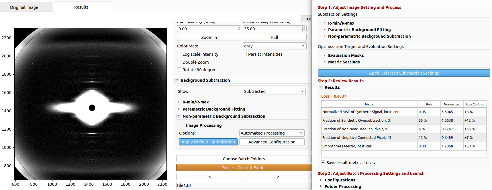
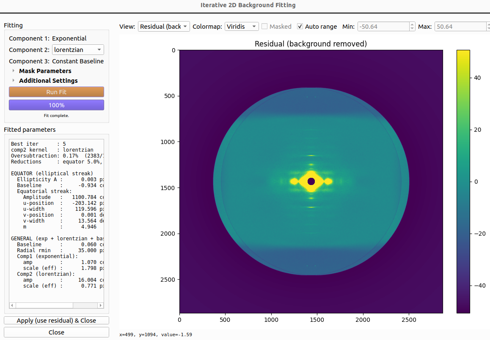
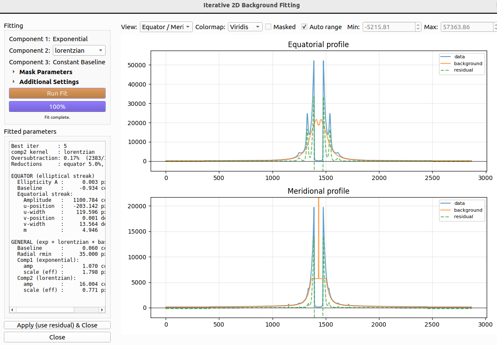
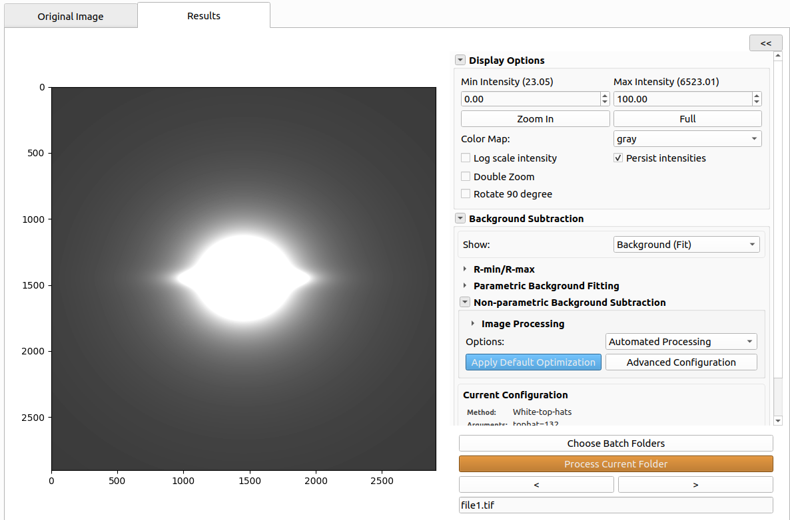

# Background Subtraction Using MuscleX: Instructions for Reviewers

This document explains how to reproduce the background subtraction results in the manuscript using MuscleX. It covers two methods, both implemented in the **Quadrant Folding** module:

- **Non-parametric subtraction + optimization** — the low-pass and morphological methods (Circularly-symmetric, Roving Window, 2D Convexhull, White-top-hats, Smoothed-Gaussian/BoxCar) plus the automated parameter-search framework. Available in MuscleX 2.0.0.
- **Iterative two-stage fitting** — the parametric fit of the equatorial streak and general background (manuscript section "Iterative Two-Stage Background Subtraction"). Currently on the `feature/iterative-bg-fitting` branch.

You can run either method from the GUI or headless from the command line. This guide provides ready-made settings files for three use cases:

| File | Use case |
|---|---|
| `A_optimize_nonparametric.json` | Search the non-parametric methods and apply the best. |
| `B_apply_fitting.json` | Run the iterative 2D fit and subtract it. |
| `C_fitting_plus_optimize.json` | Run the fit, then optimize a non-parametric background on the residual. |

Each dataset folder under `share_reviewers/` contains these three files (plus a `UI_load_dataset_settings.json` for the GUI), pre-filled with that dataset's parameters.

---

## Requirements

- Python 3.10
- ~2 GB free disk space for MuscleX and its dependencies
- A diffraction image to test with (a sample is bundled with the install, see Step 2)

---

## Step 1: Install MuscleX

**Option 1 — Prebuilt release (non-parametric method only)**

Download the latest stable release (2.0.0) by following the [MuscleX wiki](https://musclex.readthedocs.io/en/latest/Installation/overview.html).

**Option 2 — Install from source (required for the iterative fitting method)**

The iterative fitting feature is not yet in the stable release; install it from the branch:

```bash
git clone --branch feature/iterative-bg-fitting https://github.com/biocatiit/musclex.git
cd musclex
pip install -e .
```

This installs MuscleX and its dependencies (NumPy, SciPy, PySide6, pyFAI, lmfit, fabio, scikit-image, numba, h5py, pandas).

## Step 2: Get the reviewer datasets

The datasets and settings files are provided under `/home/irina/data2/share_reviewers/data/`. It contains one folder per dataset:

```
data/
├── 2022_1028/
├── 2024_0508/
├── 2024_1213/
├── 2025_0227/
├── 2026_0409_air/
├── 2026_0409_sol/
└── MPLL/
```

Each dataset folder holds:

- the folded diffraction images (`.tif`) for that dataset;
- the three use-case settings files — `A_optimize_nonparametric.json`, `B_apply_fitting.json`, `C_fitting_plus_optimize.json` — pre-filled with that dataset's ROI and mask parameters for reproducibility and consistency;
- `UI_load_dataset_settings.json` — the same parameters for loading in the GUI.

The commands below assume you have `cd`'d into a dataset folder, so the settings files can be referenced by name. To reproduce a dataset's results, run the three use cases from inside its folder.

---

## Running headless (recommended for reproducing results)

Headless mode applies a settings file to an image or folder without opening the GUI:

```bash
musclex qf -h -s <settings.json> -i <image.tif>     # single image
musclex qf -h -s <settings.json> -f <folder>         # whole folder
```

Flags:

- `-s <file>` — settings JSON (one of the three use-case files below).
- `-i <file>` / `-f <folder>` — process one image or every image in a folder.
- `-o <dir>` — output directory (defaults to a `qf_results/` folder beside the input).
- `-d` — clear cached results and force re-processing.

### Use case A — optimize non-parametric

Searches the methods listed in the settings file, picks the parameters that minimize the loss, and applies the best. No parametric fit.

```bash
musclex qf -h -s A_optimize_nonparametric.json -f . -o A_results -d
```

### Use case B — apply fitting

Runs the iterative 2D fit (equatorial streak + general background) per image and subtracts it. This is the headless equivalent of the GUI's "Run Fitting with current setting and apply." No non-parametric search.

```bash
musclex qf -h -s B_apply_fitting.json -f . -o B_results -d
```

### Use case C — fitting + optimize on top

Runs and subtracts the fit, then optimizes a non-parametric background on the residual (order: fit → subtract → optimize).

```bash
musclex qf -h -s C_fitting_plus_optimize.json -f . -o C_results -d
```

Each settings file is annotated: keys prefixed with `//` are comments, and the active parameters (methods searched, ROI, equator/layer-line mask, iterations) are pinned to each dataset's values for reproducibility. Comment out a pinned mask value to let MuscleX auto-detect it.

---

## Running from the GUI

Launch the GUI and load the matching `UI_load_dataset_settings.json` to initialize the same parameters used headless:

```bash
musclex qf
```

### Loading the parameters

Click **"Load Settings"** and select the `UI_load_dataset_settings.json` file for the dataset you want to test.


This will initialize the equator/layer-line mask, and other parameters to match the manuscript's results. You can then run any of the three use cases from the GUI.

### Case A. Non-parametric subtraction and optimization

Open the **"Results"** tab to see the quadrant-folded image and/or the background-subtracted image (if subtraction is enabled).


To run the non-parametric search:

1. Expand the **"Background Subtraction"** section. Then expand the **"Non-parametric Background Fitting"** section and select **"Automated Processing"** in the **"Options"** dropdown.
<!--  -->


 After that, click either **"Apply Default Optimization"** to search over the methods and parameters, or **"Advanced Configuration"** to adjust the settings.


2. If you choose **"Advanced Configurations"**, in the new window, expand the **"Non-parametric Background Subtraction"** and choose methods to use for optimization. The manuscript abbreviations are listed in the table below:

   | Dropdown label | Manuscript abbreviation |
   |---|---|
   | Circularly-symmetric | CS |
   | Roving Window | RW |
   | 2D Convexhull | RCH |
   | Smoothed-Gaussian | G-ILPF |
   | Smoothed-BoxCar | B-ILPF |
   | White-top-hats | WTH |
   | Average | AVG (baseline) |
   | None | No background subtraction |


3. (Optional) Adjust the optimization parameters, e.g. max iterations, parameter search step sizes, etc, evaluation mask settings. The screenshot shows the expanded sections for the additional settings. These may be left at default values.


4. Click **"Apply Selected Subtraction Settings"** to apply the current method directly.
5. The resulting metrics for the optimized background subtraction method and parameters will appear in the **"Results"** section. The resulting background subtracted pattern will be shown in the initial window in the **"Results"** tab.



Note that for the all the metrics to be saved, the **"Save result metrics to csv"** has to be checked. Otherwise, only loss is saved in `<output>/qf_results/summary.csv`.

### Case B. Iterative two-stage fitting

1. In the **"Background Subtraction"** panel, expand **"Parametric Background Fitting"** and click **"Iterative 2D Background Fitting Dialog."**


2. (Optional; may leave defaults) Configure the fit:
   - **Component 2**: general-background form (`auto`, `lorentzian`, `powerlaw`, `stretched`); `auto` reproduces the per-image model selection. Components 1 (exponential decay) and 3 (constant baseline) are fixed.
   - **Number of rounds**: equator\&general refinement rounds (default 5).
   - **Downsample factor**: downsampling during the streak fit (default 2).
   <!-- - **Use step-0 projection background**: enables the 1D projection seed ($B_0$) for round 1. -->
   - **Auto-reduce (equator && baseline)**: applies the post-fit scale factors that guard against oversubtraction; set percentages manually if disabled.
3. Click **"Run Fit"**, review the resulting residual pattern (quadrant folded - $E$ - $G$), the fitted background and the meridional/equatorial profiles. Toggle between the views using the **"View:"** options. You may adjust the clipping ranges using **"Min/Max"** or leave the **"Auto range"**.





After confirming the fit, chick **"Apply (use residual) && Close"** to subtract the fit and return to the main window.

### Case C. Iterative fitting + slowly varying non-parametric component on top

Combines Cases A and B: the iterative fit removes the equatorial streak and general background first, then a non-parametric method mops up the remaining slowly-varying component on the residual (order: fit → subtract → optimize).

1. Run the iterative fit and apply it as in **Case B**, steps 1–3 above (configure the fit, click **"Run Fit"**, review the residual, then **"Apply (use residual) && Close"**).
2. With the fit residual now shown as the working image, expand **"Background Subtraction"** and select **"Automated Processing"**, then proceed as in **Case A**, steps 1–5 above (choose methods via **"Advanced Configuration"** or use **"Apply Default Optimization"**, then apply).
3. The **"Results"** tab shows the final background-subtracted pattern (fit + non-parametric residual removed) and both of the backgrounds which can be viewed by changing the **"Show:"** to **"Background (Fit) / (Non-param)"**.




---

## Verifying results

- Summary: `<output>/qf_results/summary.csv`. Always written.
- Per-image metrics: `<output>/qf_results/bg/background_metrics.csv`, which is written when `save_metrics_to_csv` is set to true in the headless version, as in the provided files, or when **"Save result metrics to csv"** is checked.
- Fit artifacts (`_equator.tif`, `_general.tif`, `_residual.tif`, `_bgfit_params.npz`): `<output>/qf_results/bg_fit_params/`, saved whenever a fit is applied.

---

## Troubleshooting / Contact

For issues, see the [MuscleX documentation](https://musclex.readthedocs.io/) or open an [issue](https://github.com/biocatiit/musclex/issues). For questions specific to this manuscript, contact the corresponding author.
