# Background Subtraction Using MuscleX: Instructions for Reviewers

This document explains how to reproduce the background subtraction results in the manuscript using MuscleX. It covers two methods, both implemented in the **Quadrant Folding** module:

- **Non-parametric subtraction + optimization** — the low-pass and morphological methods (Circularly-symmetric, Roving Window, 2D Convexhull, White-top-hats, Smoothed-Gaussian/BoxCar) plus the automated parameter-search framework. Available in MuscleX 2.0.0.
- **Iterative two-stage fitting** — the parametric fit of the equatorial streak and general background (manuscript section "Iterative Two-Stage Background Subtraction"). Currently on the `feature/iterative-bg-fitting` branch.

You can run either method from the GUI or headless from the command line. We provide **two diffraction patterns**, one per method combination, each with its own ready-made settings files:

| Pattern | Dataset | Use cases demonstrated |
|---|---|---|
| `file1_pattern_2025_0227_AB.tif` | 2025_0227 | **Case A** (optimize non-parametric) and **Case B** (iterative 2D fit) |
| `file2_pattern_MPLL_C.tif` | MPLL | **Case C** (iterative fit + non-parametric on the residual) |

The two patterns come from different datasets, so each has its own settings files pre-filled with that dataset's ROI and mask parameters.

| Case | Use case | Procedure | CLI settings file | Pattern |
|---|---|---|---|---|
| A | I am interested in analysing higher angle meridional reflections and layer lines | Search the non-parametric methods and apply the best | `cli_settings/file1_A_optimize_nonparametric.json` | file 1 |
| B | I would like to subtract the background on the whole pattern using a parametric model | Run the iterative 2D fit and subtract it | `cli_settings/file1_B_apply_fitting.json` | file 1 |
| C | I would like to subtract the background on the whole pattern & remove some leftover residual using a smooth non-parametric method to get a clean background | Run the fit, then optimize a non-parametric background on the residual | `cli_settings/file2_C_fitting_plus_optimize.json` | file 2 |

### MuscleX documentation

Background-subtraction features used in this guide are documented in the MuscleX Quadrant Folding docs (on the `feature/iterative-bg-fitting` branch):

- [Background Subtraction — overview](https://github.com/biocatiit/musclex/blob/feature/iterative-bg-fitting/docs/AppSuite/QuadrantFolding/Quadrant-Folding--Background-Subtraction.md)
- [Background Fitting (iterative 2D fit — Cases B & C)](https://github.com/biocatiit/musclex/blob/feature/iterative-bg-fitting/docs/AppSuite/QuadrantFolding/Quadrant-Folding--Background-Fitting.md)
- [Optimization Settings (non-parametric search — Cases A & C)](https://github.com/biocatiit/musclex/blob/feature/iterative-bg-fitting/docs/AppSuite/QuadrantFolding/Quadrant-Folding--Optimization-Settings.md)

---

## Requirements

- Python 3.10 recommended. MuscleX is tested with Python 3.10 and should work with **Python 3.8 through 3.12**.
- ~2 GB free disk space for MuscleX and its dependencies
- The two reviewer patterns and their settings files (see Step 2)

---

## Step 1: Install MuscleX

**Option 1 — Prebuilt release (non-parametric method only)**

Download the latest stable release (2.0.0) by following the [MuscleX wiki](https://musclex.readthedocs.io/en/latest/Installation/overview.html).

**Option 2 — Install from source (required for the iterative fitting method)**

The iterative fitting feature is not yet in the stable release; install it from the branch:

```bash
git clone --branch feature/iterative-bg-fitting https://github.com/biocatiit/musclex.git
cd musclex
pip install -e .
```

This installs MuscleX and its dependencies (NumPy, SciPy, PySide6, pyFAI, lmfit, fabio, scikit-image, numba, h5py, pandas).

## Step 2: Get the reviewer patterns and settings

The two patterns and their settings files are provided under `/media/Data_2/irina/share_reviewers/data/subset/`:

```
subset/
├── file1_pattern_2025_0227_AB.tif      # Cases A and B
├── file2_pattern_MPLL_C.tif            # Case C
├── cli_settings/
│   ├── file1_A_optimize_nonparametric.json
│   ├── file1_B_apply_fitting.json
│   └── file2_C_fitting_plus_optimize.json
└── ui_load_settings/
    ├── file1_UI_load_dataset_settings.json
    └── file2_UI_load_dataset_settings.json
```

- The `.tif` files are the quadrant-folded diffraction patterns.
- `cli_settings/` holds the use-case settings files for headless runs, pre-filled with each dataset's ROI and mask parameters for reproducibility.
- `ui_load_settings/` holds the same parameters packaged for loading in the GUI.

The commands below assume you have `cd`'d into `subset/`, so the patterns are referenced by name and the settings files by their `cli_settings/` path.

---

## Running headless (recommended for reproducing results)

Headless mode applies a settings file to an image or folder without opening the GUI:

```bash
musclex qf -h -s <settings.json> -i <image.tif>     # single image
musclex qf -h -s <settings.json> -f <folder>         # whole folder
```

Flags:

- `-s <file>` — settings JSON (one of the three use-case files below).
- `-i <file>` / `-f <folder>` — process one image or every image in a folder.
- `-o <dir>` — output directory (defaults to a `qf_results/` folder beside the input).
- `-d` — clear cached results and force re-processing.

### Use case A — optimize non-parametric (pattern 1)

Searches the methods listed in the settings file, picks the parameters that minimize the loss, and applies the best. No parametric fit. See the [Optimization Settings docs](https://github.com/biocatiit/musclex/blob/feature/iterative-bg-fitting/docs/AppSuite/QuadrantFolding/Quadrant-Folding--Optimization-Settings.md).

```bash
musclex qf -h -s cli_settings/file1_A_optimize_nonparametric.json -i file1_pattern_2025_0227_AB.tif -o A_results -d
```

### Use case B — apply fitting (pattern 1)

Runs the iterative 2D fit (equatorial streak + general background) per image and subtracts it. This is the headless equivalent of the GUI's "Run Fitting with current setting and apply." No non-parametric search. See the [Background Fitting docs](https://github.com/biocatiit/musclex/blob/feature/iterative-bg-fitting/docs/AppSuite/QuadrantFolding/Quadrant-Folding--Background-Fitting.md).

```bash
musclex qf -h -s cli_settings/file1_B_apply_fitting.json -i file1_pattern_2025_0227_AB.tif -o B_results -d
```

The fit takes a couple of minutes per image, so processing a folder can run for a while. If you're running this over SSH or don't want the process killed when your terminal closes, run it inside `tmux` (or `screen`) so you can detach and reattach later, e.g. `tmux new -s musclex`, run the command, then detach with `Ctrl-b d`.

### Use case C — fitting + optimize on top (pattern 2)

Runs and subtracts the fit, then optimizes a non-parametric background on the residual (order: fit → subtract → optimize).

```bash
musclex qf -h -s cli_settings/file2_C_fitting_plus_optimize.json -i file2_pattern_MPLL_C.tif -o C_results -d
```

As with Use case B, the fitting step takes a couple of minutes per image — consider running this inside `tmux`/`screen` for longer folders.

Each settings file is annotated: keys prefixed with `//` are comments, and the active parameters (methods searched, ROI, equator/layer-line mask, iterations) are pinned to each dataset's values for reproducibility. Comment out a pinned mask value to let MuscleX auto-detect it.

---

## Running from the GUI

Launch the GUI and load the matching `ui_load_settings/` file to initialize the same parameters used headless. Use `file1_UI_load_dataset_settings.json` with `file1_pattern_2025_0227_AB.tif` for Cases A and B, and `file2_UI_load_dataset_settings.json` with `file2_pattern_MPLL_C.tif` for Case C:

```bash
musclex qf
```

### Loading the parameters

Open the pattern you want to test, then click **"Load Settings"** and select the matching `ui_load_settings/` file (`file1_...` for Cases A/B, `file2_...` for Case C).

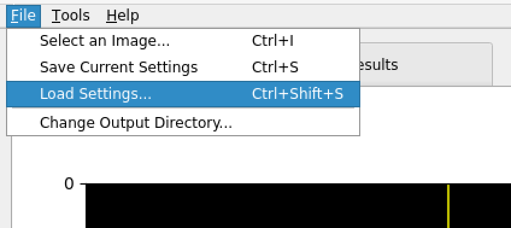


This will initialize the equator/layer-line mask, and other parameters to match the manuscript's results. You can then run the use cases for that pattern from the GUI (Cases A and B for pattern 1, Case C for pattern 2).

### Case A. Non-parametric subtraction and optimization

Uses pattern 1 (`file1_pattern_2025_0227_AB.tif`). See the [Optimization Settings docs](https://github.com/biocatiit/musclex/blob/feature/iterative-bg-fitting/docs/AppSuite/QuadrantFolding/Quadrant-Folding--Optimization-Settings.md) for details on the search parameters.

Open the **"Results"** tab to see the quadrant-folded image and/or the background-subtracted image (if subtraction is enabled).

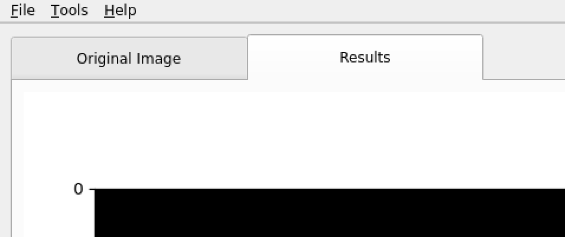


To run the non-parametric search:

1. Expand the **"Background Subtraction"** section. Then expand the **"Non-parametric Background Fitting"** section and select **"Automated Processing"** in the **"Options"** dropdown.
<!-- 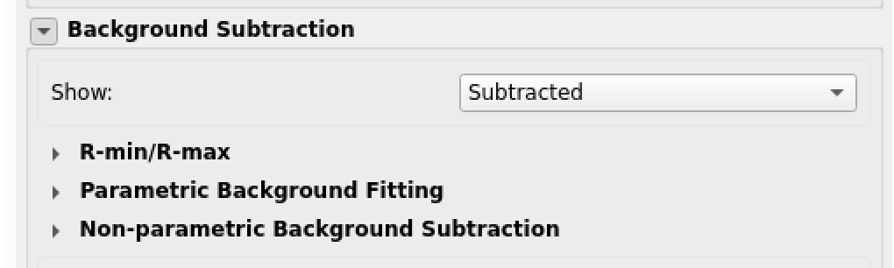 -->
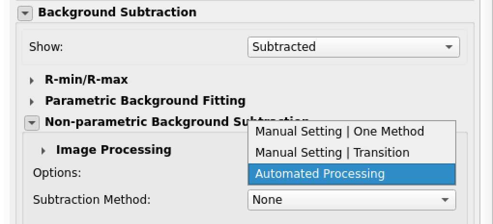

 After that, click either **"Apply Default Optimization"** to search over the methods and parameters, or **"Advanced Configuration"** to adjust the settings.

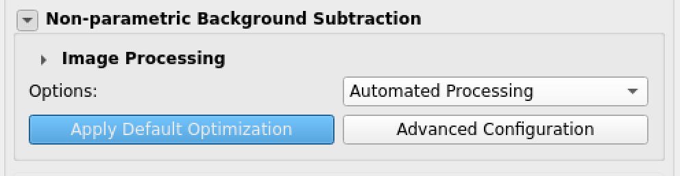

2. If you choose **"Advanced Configurations"**, in the new window, expand the **"Non-parametric Background Subtraction"** and choose methods to use for optimization. The manuscript abbreviations are listed in the table below:

   | Dropdown label | Manuscript abbreviation |
   |---|---|
   | Circularly-symmetric | CS |
   | Roving Window | RW |
   | 2D Convexhull | RCH |
   | Smoothed-Gaussian | G-ILPF |
   | Smoothed-BoxCar | B-ILPF |
   | White-top-hats | WTH |
   | Average | AVG (baseline) |
   | None | No background subtraction |

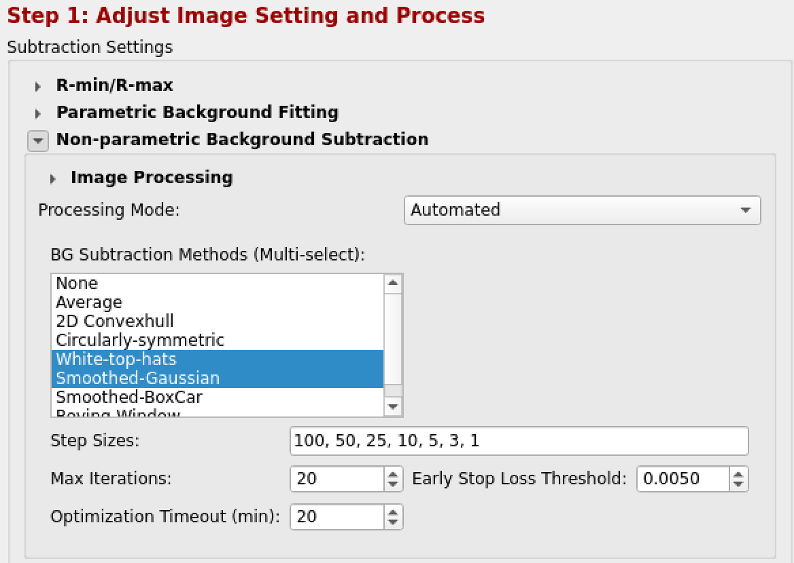

3. (Optional) Adjust the optimization parameters, e.g. max iterations, parameter search step sizes, etc, evaluation mask settings. The screenshot shows the expanded sections for the additional settings. These may be left at default values.

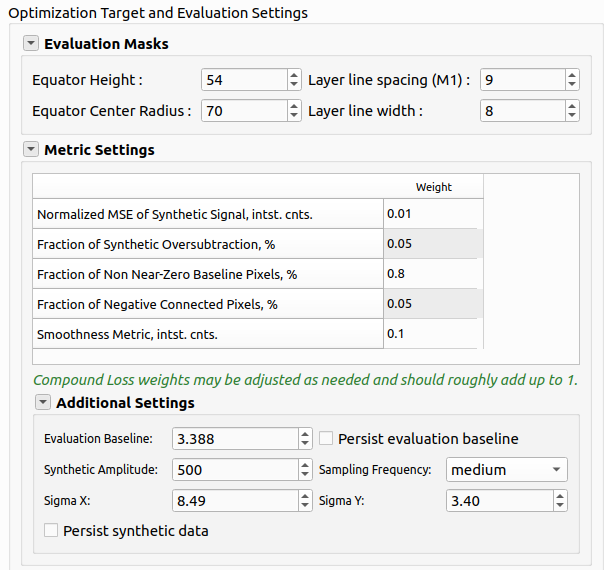


4. Click **"Apply Selected Subtraction Settings"** to apply the selected background subtraction approach or run the optimization.
5. The resulting metrics for the optimized background subtraction method and parameters will appear in the **"Results"** section. The resulting background subtracted pattern will be shown in the initial window in the **"Results"** tab.

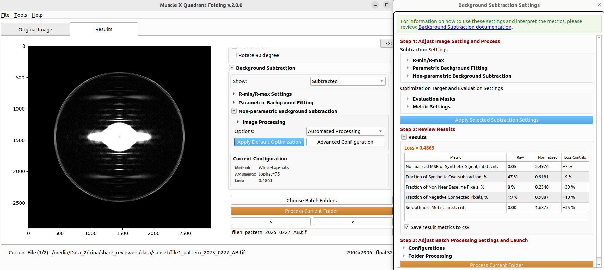

Note that the background is subtracted at higher angles, while the high-intensity
background near the pattern center and along the equator is largely retained. This is the expected behavior: it provides a relatively fast way to obtain a background-subtracted pattern suitable for studying the meridional reflections and layer lines.

For the all the metrics to be saved, the **"Save result metrics to csv"** has to be checked. Otherwise, only loss is saved in `<output>/qf_results/summary.csv`.

### Case B. Iterative two-stage fitting

Uses pattern 1 (`file1_pattern_2025_0227_AB.tif`). See the [Background Fitting docs](https://github.com/biocatiit/musclex/blob/feature/iterative-bg-fitting/docs/AppSuite/QuadrantFolding/Quadrant-Folding--Background-Fitting.md) for details on the fit components and options.

1. In the **"Background Subtraction"** panel, expand **"Parametric Background Fitting"** and click **"Iterative 2D Background Fitting Dialog."**

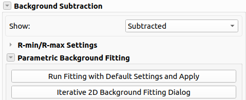 

2. (Optional; may leave defaults) Configure the fit:
   - **Component 2**: general-background form (`auto`, `lorentzian`, `powerlaw`, `stretched`); `auto` reproduces the per-image model selection. Components 1 (exponential decay) and 3 (constant baseline) are fixed.
   - **Number of rounds**: equator\&general refinement rounds (default 5).
   - **Downsample factor**: downsampling during the streak fit (default 2).
   <!-- - **Use step-0 projection background**: enables the 1D projection seed ($B_0$) for round 1. -->
   - **Auto-reduce (equator && baseline)**: applies the post-fit scale factors that guard against oversubtraction; set percentages manually if disabled.
3. Click **"Run Fit"**, review the resulting residual pattern (quadrant folded - $E$ - $G$), the fitted background and the meridional/equatorial profiles. Toggle between the views using the **"View:"** options. You may adjust the clipping ranges using **"Min/Max"** or leave the **"Auto range"**.

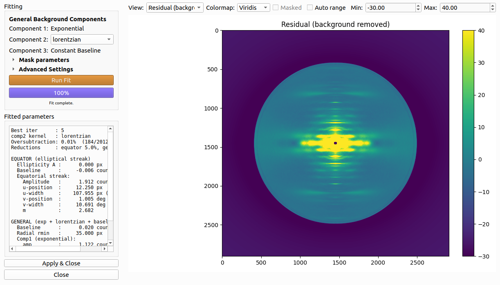

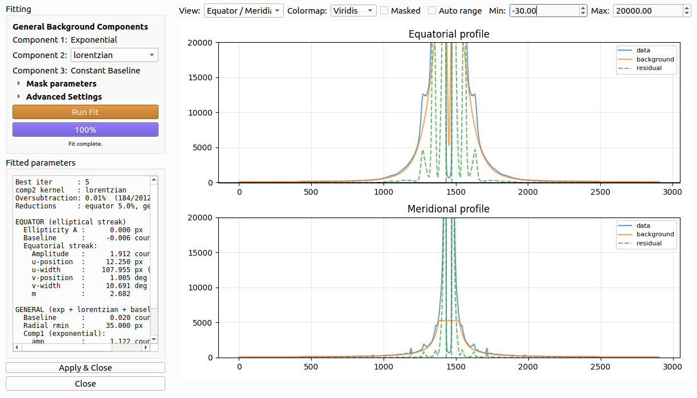 

After confirming the fit, chick **"Apply & Close"** to subtract the fit and return to the main window.

Note, that after applying the fitted background the non-parametric background is set to None. If there is leftover residual background, it may be removed using a non-parametric approach using the optimization framework. For image `file1`, if we run the optimization framework on top of the subtracted image, it will not apply other background subtraction methods as the pattern is clean and contains little residual. The next use case using `file2` demonstrates when it is preferred to apply both the fitting and the optimization framework. 

### Case C. Iterative fitting + slowly varying non-parametric component on top

Uses pattern 2 (`file2_pattern_MPLL_C.tif`). Combines Cases A and B: the iterative fit removes the equatorial streak and general background first, then a non-parametric method mops up the remaining slowly-varying component on the residual (order: fit → subtract → optimize).

1. Run the iterative fit and apply it as in **Case B**, steps 1–3 above (configure the fit, click **"Run Fit"**, review the residual, then **"Apply & Close"**).

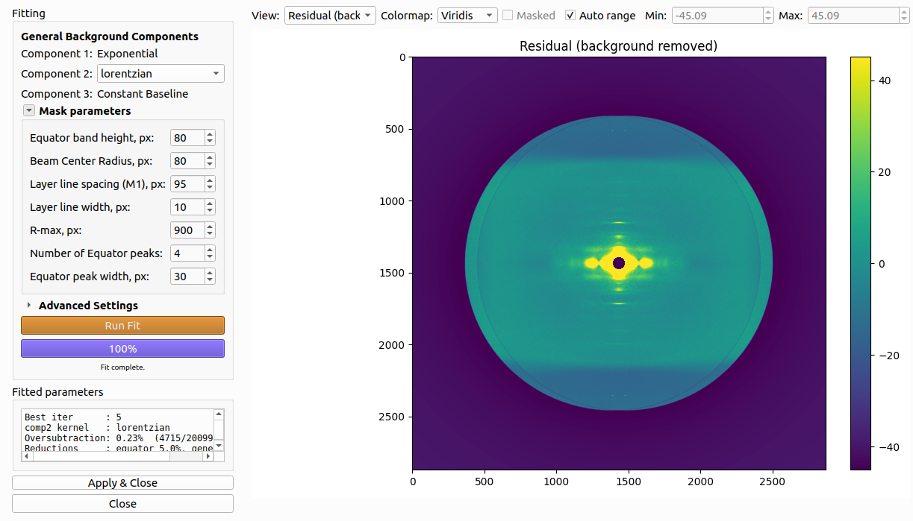 

2. With the fit residual now shown as the working image, expand **"Background Subtraction"** and select **"Automated Processing"**, then proceed as in **Case A**, steps 1–5 above (choose methods via **"Advanced Configuration"** or use **"Apply Default Optimization"**, then apply).

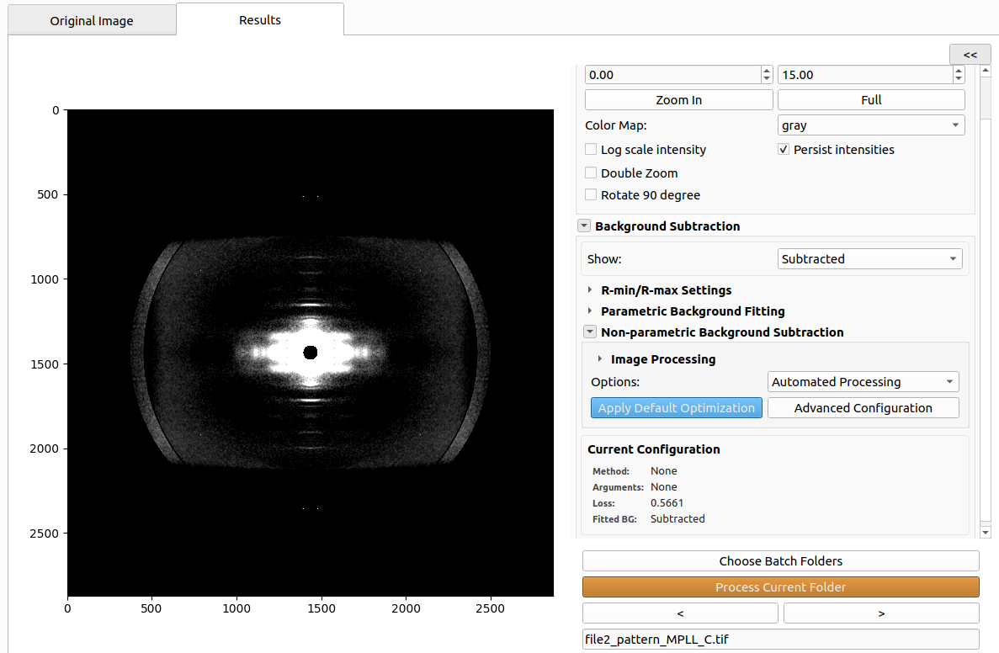  

3. The **"Results"** tab shows the final background-subtracted pattern (fit + non-parametric residual removed) and both of the backgrounds which can be viewed by changing the **"Show:"** to **"Background (Fit) / (Non-param)"**.

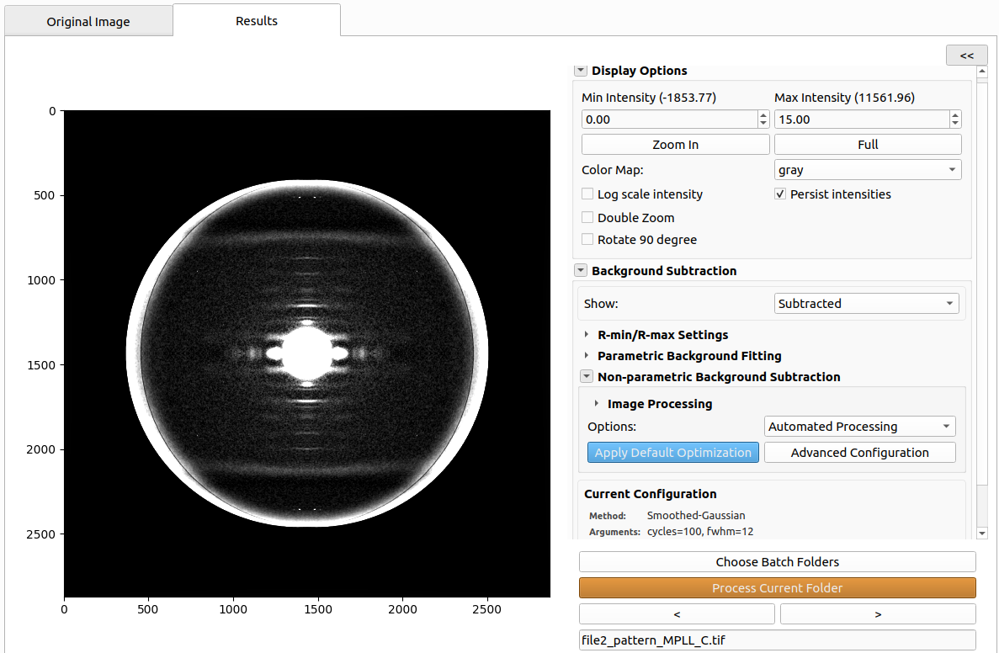

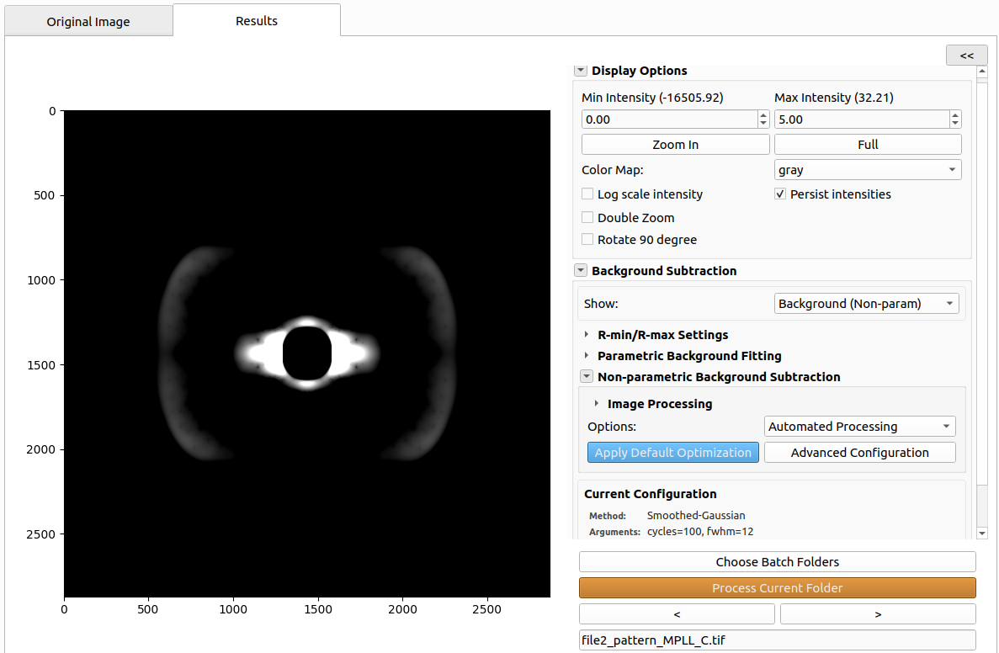

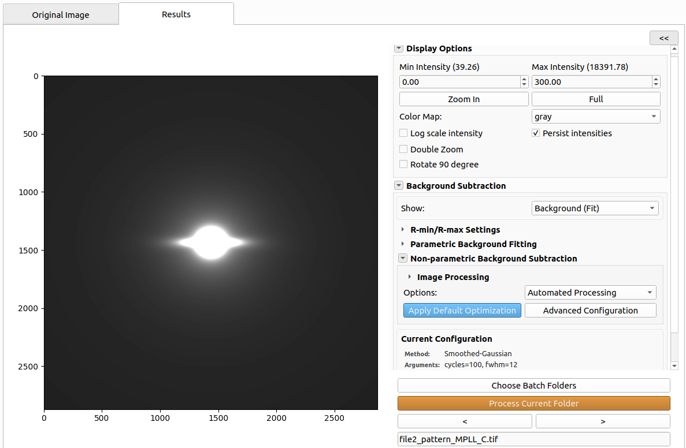 


---

## Verifying results

- Summary: `<output>/qf_results/summary.csv`. Always written.
- Per-image metrics: `<output>/qf_results/bg/background_metrics.csv`, which is written when `save_metrics_to_csv` is set to true in the headless version, as in the provided files, or when **"Save result metrics to csv"** is checked.
- Fit artifacts (`_equator.tif`, `_general.tif`, `_residual.tif`, `_bgfit_params.npz`): `<output>/qf_results/bg_fit_params/`, saved whenever a fit is applied.

---

## Troubleshooting / Contact

For issues, see the [MuscleX documentation](https://musclex.readthedocs.io/) or open an [issue](https://github.com/biocatiit/musclex/issues). For questions specific to this manuscript, contact the corresponding author.
