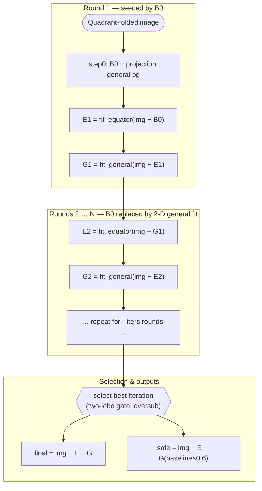

# Two‑Stage Iterative Background Removal — Report

Script: [`scripts/fit_two_stage_iterative.py`](../scripts/fit_two_stage_iterative.py)
Run analysed: `results/twostage_20260615_211253` (8 datasets × 5 images, `iters=5`, `comp2=auto`, step‑0 on).

## 1. Choosing the general‑background component (comp2)

Before running the two‑stage pipeline I fixed the general background's functional
form. It is always `exponential + comp2 + baseline`; only **comp2** (the second
radial component) is free. The choice was made empirically using [`scripts/evaluate_models.py`](../scripts/evaluate_models.py).

**The test.** For a subset of images per dataset, fit the general
background with different comp2 candidates — `none, lorentzian, gaussian,
powerlaw, stretched, cheb2, cheb` — all with the `linear_asym` loss
(oversubtraction penalised) and the `log` loss (logarithmic residuals) and the same 25–75° linear initialisation used later.
For every fit it records fit‑quality and oversubtraction metrics: `r2`,
`chi2_red`, `nrmse_pct`, `logres_bias`, `oversub_frac` (how many pixels go
negative) and `oversub_flux_frac` (how much intensity goes negative; see §5).

**The decision rule.** Each image's winner is the comp2 with the lowest
`decision_score` (lower = better), which prioritises *not* eating signal and uses
fit quality only as a tie‑break:

```
decision_score = 100 · oversub_flux_frac     # dominant: don't oversubtract
               + 0.5 · oversub_frac          # spread of oversubtraction
               + 0.1 · log(chi2_red)         # tie-break: fit quality
```

The best comp2 per image is written to `ranking.csv`.

**Results.** Two screening runs cover the eight datasets:
[`eval_20260615_171033/ranking.csv`](../results/eval_20260615_171033/ranking.csv)
and [`eval_20260615_165818/ranking.csv`](../results/eval_20260615_165818/ranking.csv).
Winning comp2 across the 22 ranked images:

| comp2 | times best | example datasets |
|---|---:|---|
| lorentzian | 10 | 0508_Weikang, 1213_Weikang (air), Jani, 2026_0409_Ma, Myokardia |
| stretched | 7 | 1213_Weikang (buffer), Ma_P1, LivePig |
| powerlaw | 4 | Granzier, Ma_P1, LivePig |
| gaussian | 1 | LivePig (P3_F4_675) |

No single comp2 wins everywhere: `lorentzian` is the most frequent best (strong
skinned‑cardiac patterns), `stretched`/`powerlaw` win on weaker / intact patterns
with heavier tails, and `gaussian`/`cheb` essentially never win. **This is why the
two‑stage run below uses `comp2=auto`** — it re‑applies this same per‑image
screening and picks the best comp2 for each image rather than committing to one
form globally.

The three comp2 forms that actually win (each added on top of `exp(−R/scale₁)`
and a flat baseline; `R` = radius from the centre):

| comp2 | functional form | free params | behaviour |
|---|---|---|---|
| **lorentzian** | `1 / (1 + (R/scale)²)` | `amp`, `scale` | Ornstein–Zernike; tail ∝ R⁻². Peaked core with a power‑law tail — fits strong, sharply‑peaked patterns. |
| **powerlaw** | `(1 + R/scale)⁻ⁿ` | `amp`, `scale`, `n` | Porod/fractal; soft (finite) core, tail ∝ R⁻ⁿ. The exponent `n` is fitted, so the tail heaviness adapts to the data. |
| **stretched** | `exp(−(R/scale)^β)` | `amp`, `scale`, `β` | Stretched exponential. `β=1` → plain exponential; `β<1` → fatter‑than‑exponential tail. `β` is fitted, giving a tunable decay between exponential and heavy‑tailed. |

(`R` is the slightly‑elongated elliptical radius when `aspect=True`, so all three
describe a near‑isotropic, mildly oval background.)


## 2. Approach

The pipeline separates a quadrant‑folded SAXS pattern into two physically distinct
backgrounds and a residual signal:

- **Equator (E)** — the anisotropic equatorial streak, fitted with the `elliptical`
  model (elliptical‑cylindrical coordinates, Murthy et al., *Polymer* 1997).
- **General (G)** — the isotropic, slightly‑elongated background, fitted as
  `exponential + {lorentzian | powerlaw | stretched} + baseline` with a
  `linear_asym` loss (oversubtraction penalised) and a 25–75° angular‑wedge
  radial profile for initialisation.

It begins from a projection‑based general background **B0** (from
`fit_projections_var_models.py`, as in `prepare_dataset.sh`) that is used for the first
equator fit, then runs **alternative iterative fitting**: each round
re‑fits the equator on `img − G`, then the general background on `img − E`. From
the second round on, B0 is replaced by the 2‑D general fit and drops out of the
final residual.

By default the equator reconstruction has its flat baseline zeroed, so the equator
stage subtracts **only the streak** and the general stage owns the flat floor.
Two safety knobs scale models *post‑fit* (no refit): `--baseline-reduction`
(general flat floor, 40 % in this run) and `--equator-reduction` (whole equator
streak), both guarding against oversubtraction.



Per image the script writes the equator / general / residual TIFFs for every
round, two final residuals (as‑is and baseline‑reduced), a per‑image report, an
overview PNG, and one summary‑CSV row.

## 3. Datasets

Biological categories are from [`datasets_categories.txt`](../datasets_categories.txt).
All eight folders are cardiac/muscle SAXS; this run sampled 5 images each.

| Dataset folder | Biological category | Condition | Pattern strength |
|---|---|---|---|
| `2025_0227_Jani` | Skinned pig cardiac | Skinned, solution | Strong |
| `MyokardiaPatternsWithLL` | Skinned pig cardiac | With layer lines (LL) | Strong |
| `2024_0508_Weikang` | Skinned pig cardiac | High calcium (LL ↓) | Weak–medium |
| `2024_1213_Weikang` | Skinned pig cardiac | Pathological (off‑axis) | Medium |
| `2026_02_04_Ma` | **[?]** Skinned cardiac | RV, single frames | Weak |
| `2026_0409_Ma` | Skinned mouse cardiac | Air & solution | Strong |
| `LivePig` | Intact pig cardiac | Single frame, solution | Weak |
| `P3 (P3_F4_675)` | Intact pig cardiac | Summed frames  | Strong |


### Setup (run config)

`crop_size=2048`, `downsample_factor=2`, `rmin_mask=30`, equatorial strip
`eq_cut=300`, general strip `gen_hwidth=2000`, wedge `25–75°`,
`eq_neg_weight=20`, `gen_neg_weight=10`, `iters=5`, `comp2=auto` (per‑image
choice among lorentzian / powerlaw / stretched), `baseline_reduction=0.40`,
step‑0 = projection power‑law (`m=3`).

## 4. Example outputs

Each overview PNG shows (rows) the 2‑D intensity panels, residual maps, and 1‑D
equatorial/meridional profiles with the equator and general fits isolated.

- **Intact pig cardiac summed (P3), strong:**
  [`P3/…P3_F1_657_3_153_…0026 … _overview.png`](../results/twostage_20260615_211253/P3/tif_files__P3_F1_657_3_153_data_000001_0026_folded_compressed/tif_files__P3_F1_657_3_153_data_000001_0026_folded_compressed_overview.png)
- **Intact pig cardiac (LivePig), single frame:**
  [`LivePig/orig_imgs__res_00004 … _overview.png`](../results/twostage_20260615_211253/LivePig/orig_imgs__res_00004_folded_compressed/orig_imgs__res_00004_folded_compressed_overview.png)
- **Skinned pig cardiac (Jani), strong: (pCa)**
  [`2025_0227_Jani/…F1_P1_pCa8_CK586A_00001 … _overview.png`](../results/twostage_20260615_211253/2025_0227_Jani/2025_0227_Jani__F1_P1_pCa8_CK586A_00001_folded_compressed/2025_0227_Jani__F1_P1_pCa8_CK586A_00001_folded_compressed_overview.png)
- **Skinned pig cardiac with layer lines (Myokardia) (pCa):**
  [`MyokardiaPatternsWithLL/…F12_pCa8_DMSO_0002 … _overview.png`](../results/twostage_20260615_211253/MyokardiaPatternsWithLL/MyokardiaPatternsWithLL__F12_pCa8_DMSO_0002_folded_compressed/MyokardiaPatternsWithLL__F12_pCa8_DMSO_0002_folded_compressed_overview.png)
- **Skinned mouse cardiac (Ma), air:**
  [`2026_0409_Ma/…F20_WM_MOUSE_20_AIR_00001 … _overview.png`](../results/twostage_20260615_211253/2026_0409_Ma/2026_0409_Ma__F20_WM_MOUSE_20_AIR_00001_folded_compressed/2026_0409_Ma__F20_WM_MOUSE_20_AIR_00001_folded_compressed_overview.png)
- **Skinned mouse cardiac (Ma), solution:**
  [`2026_0409_Ma/…F34_141_HET_690_8_SL23_SOL_00002 … _overview.png`](../results/twostage_20260615_211253/2026_0409_Ma/2026_0409_Ma__F34_141_HET_690_8_SL23_SOL_00002_folded_compressed/2026_0409_Ma__F34_141_HET_690_8_SL23_SOL_00002_folded_compressed_overview.png)

## 5. Metrics — average per dataset

Averaged over 5 images each (from
[`summary.csv`](../results/twostage_20260615_211253/summary.csv)). All "negative"
and "oversub" figures are over the real‑data region of the **final residual**.

- **neg% (step0)** — negative‑pixel fraction after step‑0 only (reference point).
- **neg% (as‑is)** — `img − E − G`.
- **neg% (reduced)** — with general baseline cut 40 % (the "safe" final).
- **oversub flux** — oversubtracted intensity ÷ positive intensity (lower = better).
- **min** — most negative single pixel (intensity units).

| Dataset | n | neg% step0 | neg% as‑is | neg% reduced | oversub as‑is | oversub reduced | 
|---|---:|---:|---:|---:|---:|---:|
| 2025_0227_Jani | 5 | 15.0 | 18.6 | **5.8** | 0.408 | 0.227 | 
| MyokardiaPatternsWithLL | 5 | 18.2 | 20.2 | **6.2** | 0.442 | 0.141 |
| 2024_0508_Weikang | 5 | 19.4 | 31.0 | **0.7** | 0.091 | 0.004 | 
| 2024_1213_Weikang | 5 | 25.8 | 21.0 | **5.6** | 0.368 | 0.065 | 
| 2026_02_04_Ma | 5 | 6.0 | 15.0 | **6.9** | 0.050 | 0.032 |
| 2026_0409_Ma | 5 | 24.1 | 12.7 | **1.7** | 0.365 | 0.089 | 
| LivePig | 5 | 34.1 | 26.6 | **9.4** | 0.311 | 0.200 |
| P3 | 5 | 36.8 | 29.1 | **16.4** | 0.220 | 0.138 |
| **ALL** | **40** | **22.4** | **21.8** | **6.6** | **0.282** | **0.112** |

Mean runtime ≈ 488 s/image. Auto‑selected `comp2`: stretched ×21, powerlaw ×12,
lorentzian ×7.

### Observations

- The 40 % baseline reduction removes broad, shallow oversubtraction
  but **not** the few deep negatives. The few deep negatives near the beam stop should be addressed separately.
- Those deep negatives (Jani, Myokardia) sit at the
  masked beam centre, where the isotropic general exponential extrapolates into the
  beamstop and the equatorial streak model is tallest — the center‑oversubtraction
  issue documented separately.
    - Might have to do with the masking of the beam center. (TODO)
   - Additional we can reduce the equatiorial fit by a percentage:
      - EG (new run): **Skinned pig cardiac (Jani), strong: (pCa)** [`2025_0227_Jani/…F1_P1_pCa8_CK586A_00001 … _overview.png`](../results/twostage_20260616_081844/2025_0227_Jani/2025_0227_Jani__F1_P1_pCa8_CK586A_00001_folded_compressed/2025_0227_Jani__F1_P1_pCa8_CK586A_00001_folded_compressed_overview.png)
      - EG (new run): **Intact pig cardiac summed (P3), strong:**
  [`P3/…P3_F1_657_3_153_…0026 … _overview.png`](../results/twostage_20260616_081844/P3/tif_files__P3_F1_657_3_153_data_000001_0026_folded_compressed/tif_files__P3_F1_657_3_153_data_000001_0026_folded_compressed_overview.png)
- Any remaining background at high angles that is added back when correcting the baseline may be further removed using a smooth non-parametric approach using the **optimization framework**.
- Weak‑pattern (LivePig, P3) have the highest residual negative fractions even after reduction, suggesting the baseline correction should be stronger for these datasets.
- Calcium patterns (2025_0227_Jani, MyokardiaPatternsWithLL, 2024_0508_Weikang) produce bad fits visually and the equator streak is not always fitted properly.
